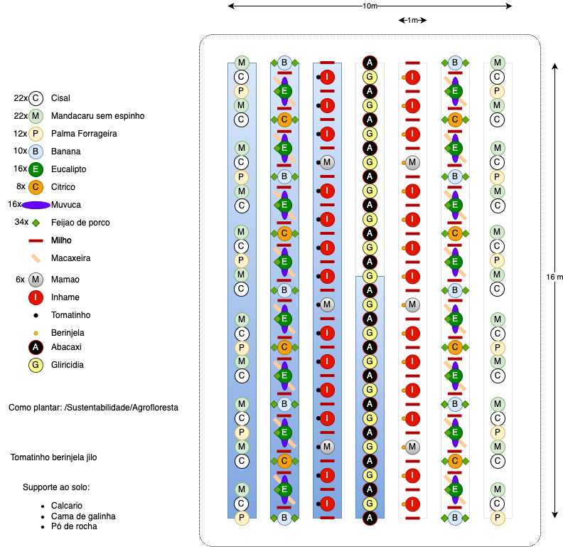
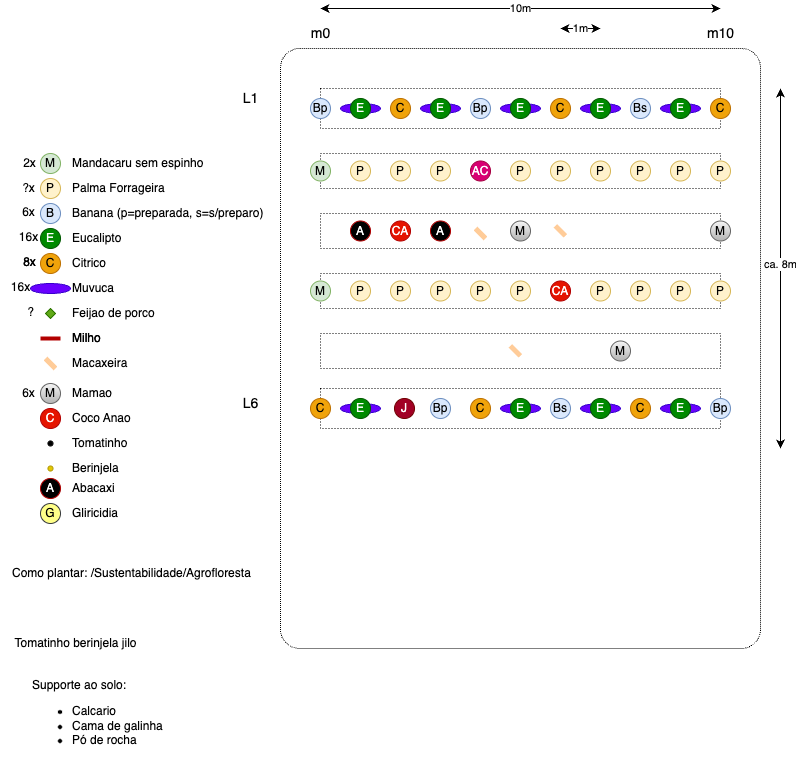

# Contexto
Esta foi nossa primeira tentativa de plantar algo.
O período das chuvas ja tinha passado, esta não era a hora de plantar.

## Planejamento e racional
1. Primeiramente, planejei o plantio em 6 linhas, como ilustrado abaixo. 
Em azul eu planejava enriquecer o solo com calcario, esterco, etc.

O arquivo .drawio está disponível clicando em "salvar como" na imagem.

# Consórcios idealizados
1. Mandacaru, Cisal, e Palma
2. Eucalipto (+muvuca), Banana, Citrus

# Consórcios efetivamente realizados

# Problemas encontrados
1. O terreno era inclinado
2. De acordo com Antonio e Ernst, neste caso as linhas deveriam ser feitas subindo o morro.

3. Bananas tinham broca
4. Eu nao sabia como plantar as bananas. [Descricao das tentativas](bananeiras.md)
5. Nao consegui insumos
6. A biomassa veio toda de fora de Canjuao e madeira espinhosa. 
7. A agua do poço do vizinho é bastante amarela, provavelmente saloba.
8. Nao encontrei mudas de eucalipto. Plantei de sementes, mas nao nasceram.

# Lições aprendidas
- A madeira espinhosa nao deveria ser usada nas linhas. Ela tem pouca biomassa e ficou dificil de manejar.
- O Canjoao ficaria bem melhor se fosse triturado
- Comprar mudas de eucalipto tipo [Nome e referencia]

# Informações adicionais
